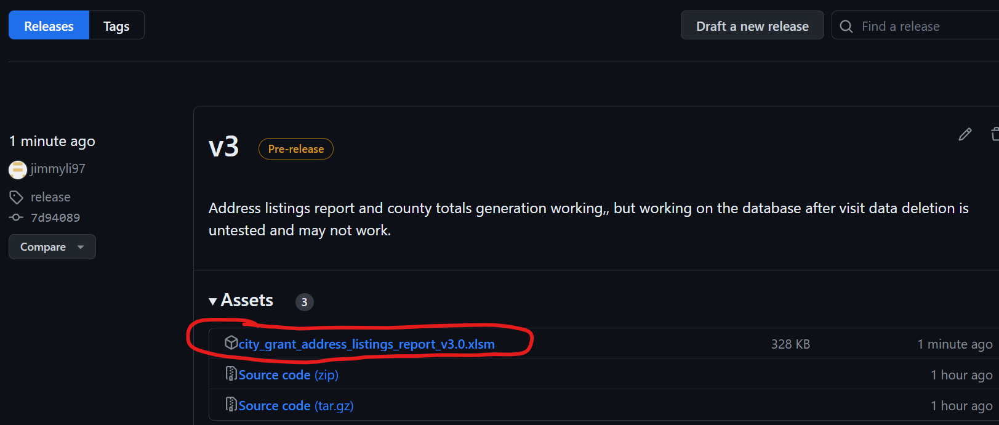

# Gaithersburg City Grant and Montgomery County Totals Report
## About
This Excel macro workbook takes in visit data records exported as a CSV from food bank manager software such as Soxbox and produces the quarterly address listings report for Gaithersburg City as well as the monthly Montgomery County visit totals report.

To print this documentation, click [here](README.md) and print that page.

### Overview:
1) Imports visit data records
2) Groups visit data records together by address
3) Attempts to validate addresses against the Gaithersburg Address database
4) Can additionally validate addresses against the Google Address Validation API
5) Can additionally accept user input to fix invalid addresses
6) Produces visit totals as well as the Gaithersburg City address listings report

# Using the XLSM file
## Downloading the XLSM
1) Ensure you have the latest version. Download the [latest release of the XLSM file](https://github.com/jimmyli97/gaithersburg_city_grant_address_report/releases). Click on the "Assets" title and then click on the XLSM to download. 

    * If you have data in an older release version, in the new file on the "Interface" sheet, click "Import Data" and select the older file. All data will be copied over to the new version.
2) The same file can be used from year to year and from quarter to quarter. The XLSM file will remember previously validated and user edited addresses.
3) If this is the first quarter, name the file with the current fiscal year, "e.g. City Grant Address Listings Report v3.0 FY24.xlsm"
    * If you have a file from the last fiscal year, make a copy of it for this fiscal year and rename it. Then on the "Addresses" sheet, click "Delete All Visit Data" to delete all visit data but keep address data.
## Importing data
1) Log into your food bank manager and export data as a CSV. The visit data does not need to be quarterly, the XLSM file will automatically sort by quarter. The visit data can also be imported at any time, you don't have to do it all at once at the end of the quarter.
    1) For Gaithersburg HELP Soxbox, log in [here](https://ghp.soxbox.co/login). Go to Visit History Export:
       
    2) Select the dates you wish to export. For instance, to run the county monthly totals for this month, export dates for this month only. Select the preset "city and county grant address v3". Click "Export" and save the CSV file
       
2) Open the exported CSV file. Filter by tracking method or service for the visit data that you want to report on. Select all data except for the header (click on Row 2 to select, then press Shift-End-Down). Ctrl-C to copy.
    * If you forget to import an extra tracking method, you can repeat this step but filter on only the extra tracking method.
    * If you accidentally imported an extra tracking method, you can click "Delete All Visit Data" in the "Addresses" sheet in the XLSM file to delete all tracking methods, and then reimport only the tracking methods you wish to report on.
    
3) Open the XLSM file. If you see the Protected View warning message, click the "Enable Editing" button. If you see that macros from the internet are disabled, close the workbook, right click on the workbook in File Explorer, go to Properties, at the bottom of the General tab check the Unlock checkbox, and open the workbook again (see [this link](https://learn.microsoft.com/en-us/deployoffice/security/internet-macros-blocked)).
4) On the "Interface" sheet, click "Paste Records"
5) On the "Interface" sheet, click "Add Records". This validates all addresses against the Gaithersburg database. This takes about 4 minutes per 1000 records, depending on your computer and internet. Progress can be seen in the lower left corner of the screen, you cannot use Excel but you can use other programs on your computer.
    * If you need to stop execution, hit Esc. If you stop execution, you will need to start over from step 4.
6) Successfully validated addresses can be seen in the "Addresses" sheet.
7) The total counts for addresses can be seen on the "Interface" sheet. The top right quarterly totals count valid Gaithersburg addresses only. The county totals count all addresses, both valid and invalid. You can generate a final report and county totals now (see [here](#generating-totals-and-final-report)) or validate addresses first.
## Validating addresses
1) Google Address Validation requires a [Google Address Validation key](https://developers.google.com/maps/documentation/address-validation/get-api-key). This file expects a file named "apikeys.csv" formatted as "address_key,apikey", placed in the same directory as the XLSM.
2) This XLSM file attempts to keep usage of the API within the free tier and limits you to 8,000 requests per month. To increase this limit, email me.
3) On the "Needs Autocorrect" sheet, click "Attempt validation" This will attempt to validate all addresses against Google Address Validation and then against the Gaithersburg database. Addresses returned from this validation will be placed in the "Validated Address", "Validated Unit Type and No.", and "Validated Zip Code" fields.
    * The same restrictions apply as before while validating addresses (you cannot use excel, progress will be shown in the lower left corner, etc.)
4) 
## Generating totals and final report ##