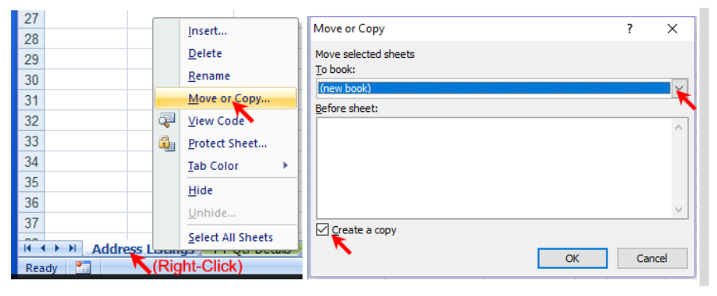

# Gaithersburg City Grant and Montgomery County Totals Report
## About
This Excel macro workbook takes in visit data records exported as a CSV from food bank manager software such as Soxbox and produces the quarterly address listings report for Gaithersburg City as well as the monthly Montgomery County visit totals report.

To print this documentation, click [here](README.md) and print that page.

### Overview:
1) Imports visit data records
2) Groups visit data records together by address
3) Attempts to validate addresses against the Gaithersburg Address database
4) Can additionally validate addresses against the Google Address Validation API
5) Can additionally accept user input to fix invalid addresses
6) Produces visit totals as well as the Gaithersburg City address listings report

# Using the XLSM file
## Downloading the XLSM
1) Ensure you have the latest version. Download the [latest release of the XLSM file](https://github.com/jimmyli97/gaithersburg_city_grant_address_report/releases). Click on the "Assets" title and then click on the XLSM to download. 

    * If you have data in an older release version, in the new file on the "Interface" sheet, click "Import Data" and select the older file. All data will be copied over to the new version.
2) The same file can be used from year to year and from quarter to quarter. The XLSM file will remember previously validated and user edited addresses. The date of the most recent imported service is stored in D1 of the "Interface" sheet.
3) If this is the first quarter, name the file with the current fiscal year, "e.g. City Grant Address Listings Report v3.0 FY24.xlsm"
    * If you have a file from the last fiscal year, make a copy of it for this fiscal year and rename it. Then on the "Addresses" sheet, click "Delete All Visit Data" to delete all visit data but keep address data.
## Importing data
1) Log into your food bank manager and export data as a CSV. The visit data does not need to be quarterly, the XLSM file will automatically sort by quarter. The visit data can also be imported at any time, you don't have to do it all at once at the end of the quarter.
    1) For Gaithersburg HELP Soxbox, log in [here](https://ghp.soxbox.co/login). Go to Visit History Export:
       
    2) Select the preset "city and county grant address v3", then select the dates you wish to export. For example, if you've already processed all the addresses up to but not including February 1, but you want to process addresses from February 1 to 29, select Visit On dates starting on February 1 and ending on February 29. Click "Export" and save the CSV file
       
2) Open the exported CSV file. Filter by tracking method or service for the visit data that you want to report on. Select all data except for the header (click on Row 2 to select, then press Shift-End-Down). Ctrl-C to copy.
    * If you forget to import an extra tracking method, you can repeat this step but filter on only the extra tracking method.
    * If you accidentally imported an extra tracking method, you can click "Delete All Visit Data" in the "Addresses" sheet in the XLSM file to delete all tracking methods, and then reimport only the tracking methods you wish to report on.
    
3) Open the XLSM file. If you see the Protected View warning message, click the "Enable Editing" button. If you see that macros from the internet are disabled, close the workbook, right click on the workbook in File Explorer, go to Properties, at the bottom of the General tab check the Unlock checkbox, and open the workbook again (see [this link](https://learn.microsoft.com/en-us/deployoffice/security/internet-macros-blocked)).  If you see the Make This A Trusted Document warning message, click Yes.
4) On the "Interface" sheet, click "Paste Records". This will paste records into the Interface sheet, but will not make any changes to the database. If you need to make any edits, now is the time to do so.
5) On the "Interface" sheet, click "Add Records". This will match all records against existing records in the file. All new addresses will be validated against the Gaithersburg database only. This takes about 4 minutes per 1000 records, depending on your computer and internet. Progress can be seen in the lower left corner of the screen, you cannot use Excel but you can use other programs on your computer.
    * Progress is tracked in the status bar in the bottom left. Program is finished when the status bar says "Ready" or when the mouse icon is no longer the spinning busy icon
    * If you need to stop execution, hit Esc. If you stop execution, you will need to start over from step 4.
6) Addresses matching existing addresses in the "Addresses", "Needs Autocorrect" or "Discards" sheets will be merged. Successfully validated addresses can be seen in the "Addresses" sheet and will be marked with an "In City" code of "Yes". All other addresses will be moved to the "Needs Autocorrect" sheet.
7) I recommend at least automatically validating addresses first, but you can generate a final report and county totals now (see [here](#generating-totals-and-final-report)). Before editing addresses by hand, automatically validate addresses first.
## Automatically validating addresses
1) Google Address Validation requires a [Google Address Validation key](https://developers.google.com/maps/documentation/address-validation/get-api-key). This file expects a file named "apikeys.csv" formatted as "address_key,apikey", placed in the same directory as the XLSM.
	* If your directory is a OneDrive directory, Right Click both files and set to Always Keep On This Device
2) This XLSM file attempts to keep usage of the API within the free tier and limits you to 8,000 requests per month. To increase this limit, email me.
3) On the "Needs Autocorrect" sheet, click "Attempt validation" This will attempt to autocorrect and validate all addresses against Google Address Validation if the In City Code is "Not yet autocorrected". Addresses returned from this validation will be placed in the "Validated Address", "Validated Unit Type and No.", and "Validated Zip Code" fields. All addresses are then verified on the "Validated" address fields against the Gaithersburg database. 
    * The same restrictions apply as before while validating addresses (you cannot use excel, progress will be shown in the lower left corner, etc.)
4) After validation, addresses will show up in either the "Addresses" sheet, the "Needs Autocorrect" sheet, or the "Discards" sheet. Any addresses automatically autocorrected by the XLSM file will additionally show up in the "Autocorrected" sheet.
    * Addresses that were autocorrected and in Gaithersburg will be marked with an "In City" code of "Yes" and be placed in the "Addresses" sheet.
    * Addresses that were autocorrected and not in Gaithersburg will be marked with an "In City" code of "No" and be placed in the "Addresses" sheet.
    * Addresses that were marked as not correctable (one word addresses, etc.) will be marked with an "In City" code of "Not correctable" and be placed in the "Discards" sheet
    * Addresses that could not be autocorrected but were predicted to not be in Gaithersburg (not in zips 20877, 20878, 20879, not in Gaithersburg city bounds) will be marked with an "In City" code of "Failed autocorrection and geocoded not in city" and be placed in the "Discards" sheet
    * Addresses that could not be autocorrected but were predicted to be in Gaithersburg will be marked with an "In City" code of "Possible but failed autocorrection" and be placed in the "Needs Autocorrect" sheet
5) You can generate a final report and county totals now (see [here](#generating-totals-and-final-report)), or continue with editing addresses by hand.
## Manually validating addresses
### Editing
1) Before manually editing addresses, automatically validate addresses first. All user editing should be done in the "Validated" fields in the "Needs Autocorrect" sheet, NOT in other sheets. This makes sure the program moves records correctly. The "Raw" fields are ignored after automatic validation and should not be edited. Go through each address and type in a valid address for the record in the corresponding "Validated" field (see [Tips for validating addresses](#Tips-for-validating-addresses)). As you do so, the "User Verified" field will be set to "True" for that record. If you accidentally edit a record, click "Toggle User Verified" to set the record back to "False".
2) Click "Attempt Validation". All "True" "User Verified" records will be validated again against the Gaithersburg database using the user input address. You don't have to correct all records before clicking "Attempt Validation".
3) Select any records which cannot be corrected and click "Discard selected" to move those records to the "Discards" sheet. Alternatively, you can click "Discard All" to discard all remaining records in the "Needs Autocorrect" sheet.
4) To fix accidentally discarded addresses, select them in the "Discards" sheet and click "Restore selected discards". They will be moved back to the "Needs Autocorrect" sheet.
5) To fix records incorrectly marked as "Yes" or "No, select them in the "Addresses" sheet and click "Move to needs autocorrect". They will be moved back to the "Needs Autocorrect" sheet.
6) If verifying Autocorrected addresses, you can toggle records as verified so you know which ones you have verified as correct
7) For additional corrections, see [Tips for editing](#Tips-for-editing)
8) See [here](#generating-totals-and-final-report) to generate the final report and county totals
### Tips for validating addresses
1) Check if the address is similar to any Gaithersburg street names. Click "Open List of Gaithersburg Streets" in the "Needs Autocorrect" sheet to get the list. You can use Ctrl-F in the browser to look for similar street names. Discard if not in the list.
2) Check for typos by selecting record and execute the LookupInCity macro Ctrl+Shift+L to look up that record via the Gaithersburg City address search page, in a browser window. Delete some characters to find similar addresses (e.g. “3 Summit” instead of “3A S Summit St”)
    * A common error is the unit letter being in the unit number instead of in the address, e.g. 425 N Frederick Ave Unit 1C should be 425C N Frederick Ave Unit 1
    * Two streets with apostrophes exist, O’Neill and Odend’hal
    * You can click on the address in the City address search page to see a map where Gaithersburg borders are highlighted in red and house numbers are visible.
3) You can also check for typos in Google Maps, and check the apartment range by typing into the USPS lookup page with no apartment number.
    * In the USPS website, the DPV Confirmation will be Y for a valid address, and a different letter if invalid.
5) Look at the keyboard for possible typos, e.g. 419 was entered instead of 119
6) If unable to validate unit type and number but you can validate the address, the XLSM file will accept it if "User Verified" is set to "True" and the "Validated" unit type and number fields are blank before clicking "Attempt Validation"
### Tips for editing
1) To change multiple addresses, you can filter on the addresses you want to change. You can fill on the filtered list by clicking and dragging on the bottom right corner of the cell to e.g. change multiple rows to the same value. This doesn’t affect hidden filtered rows.
    * You must disable the filters before clicking any buttons, the XLSM will check for enabled filters before allowing further changes.
2) All sheets are protected from editing except for the "Validated" fields in the "Needs Autocorrect" sheet and the rows of pasted records in the "Interface" sheet. If for some reason you need to edit something, click the "Review" tab on the menu and click "Unprotect Sheet". When the workbook is saved all sheets will be reprotected.
## Generating totals and final report ##
1) Confirm that the XLSM only has the tracking methods that you want to report on. Check the "Addresses", "Needs Autocorrect", "Discards" columns to the right of "Rx Total".
    * If there is an extra tracking method, you can click "Delete All Visit Data" and then reimport all of the visits. 
2) The total counts for addresses can be seen on the "Interface" sheet. The top right quarterly totals count valid Gaithersburg addresses only. The county totals count all addresses, both valid, invalid, discarded, not yet autocorrected, etc.
3) On the "Interface" sheet, click "Generate Final Report". This will be output to the "Final Report" sheet. This outputs every address per unique guest ID, sorted by street name.
4) Right-click the "Final Report" sheet and select "Move or copy". Select "(new book)" and check the “Create a copy” box. 
	
5) Save the new workbook as the final grant report to be sent, named City FYnn Qn [Service] GHELP Address Listings.xlsx, for example City FY18 Q3 Food GHELP Address Listings.xlsx.
6) On the "Interface" sheet, select the month you want to report County totals for. Click "Copy selected zip totals code and open county totals site". This will open the county totals form in the browser.
7) Under "Select your organization", select the organization. Wait for the top left corner to say "Saved".
8) In the browser, hit F12 to open developer tools. Select the "Console" tab. Click to the right of the > symbol to set the cursor. Paste using Ctrl-V into the console and hit Enter. If you receive a warning, type in 'allow pasting' without quotes and hit Enter, then paste using Ctrl-V and hit enter. This will refresh the page and all values will be filled in. Double check the zip code total values for e.g. 20878, 20877, 20879, since this code will break if the form gets updated.
    
9) Fill in the other questions. Save a copy before submitting the form. Note that these instructions will be different depending on what browser you're using. In the browser, hit Ctrl-P to print. In the Printer, select "Save as PDF"/"Microsoft Print to PDF". Scroll down to "More Settings" and click the dropdown. Check the "Background Graphics" checkbox and uncheck the "Headers and Footers" checkbox if it exists. Click "Print". Choose a filename and click "Save". Submit the form.
	
	
